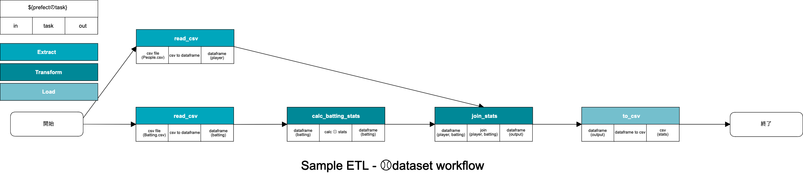

# ETL Workflow Sample for prefect and baseball.

This repository contains **Dockerfile** of Log ETL for [prefect](https://github.com/PrefectHQ/prefect).



[baseballdatabank](https://github.com/chadwickbureau/baseballdatabank) のCSVを取り込んでデータ生成をするsample.

## Setting

事前に[baseballdatabank](https://github.com/chadwickbureau/baseballdatabank) をlocalにclone

```bash
$ git clone git@github.com:chadwickbureau/baseballdatabank.git
$ cd baseballdatabank/core
$ pwd  # このpathを使います
/Users/hoge/baseballdatabank/core
```

## install

### local

```bash
$ python3 -m venv venv
$ source venv/bin/activate
(venv) $ pip install -r requirements.txt
```

## Usage

### local

```bash
(venv) $ python app.py --directory /Users/hoge/baseballdatabank/core --run-date 2020-07-30
```

# Maintainer

[@shinyorke(Shinichi-Nakagawa)](https://github.com/Shinichi-Nakagawa)
